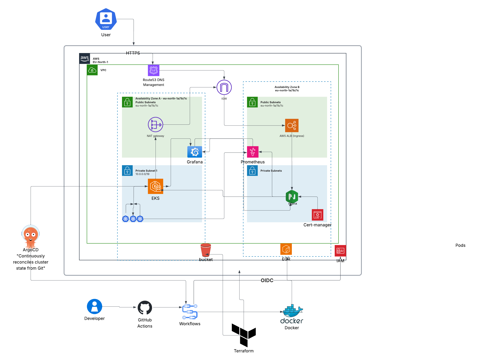
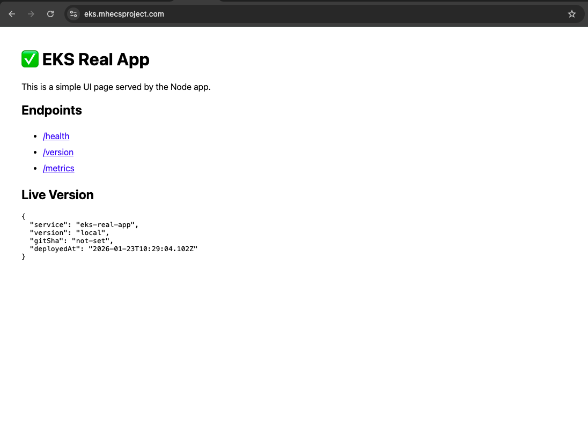
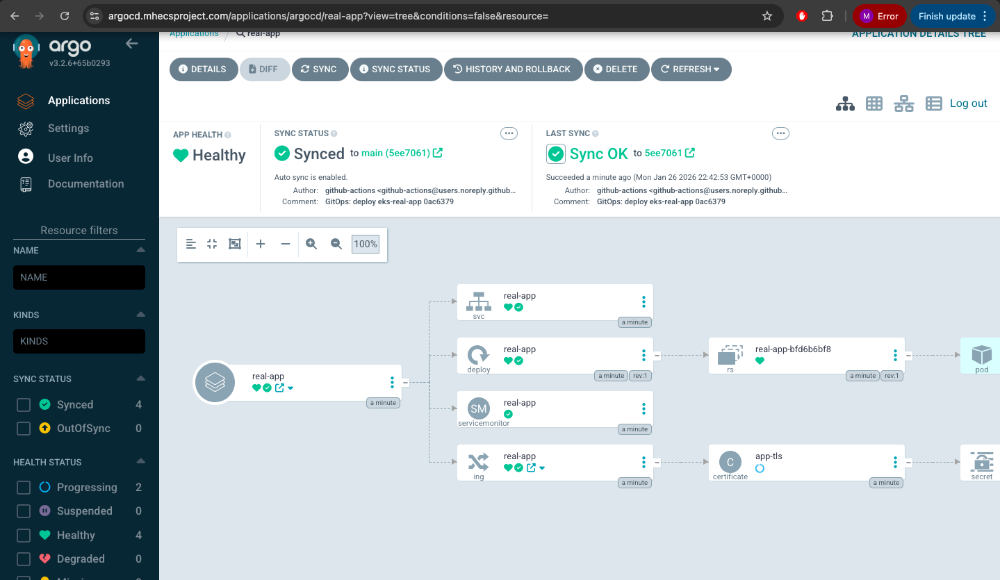
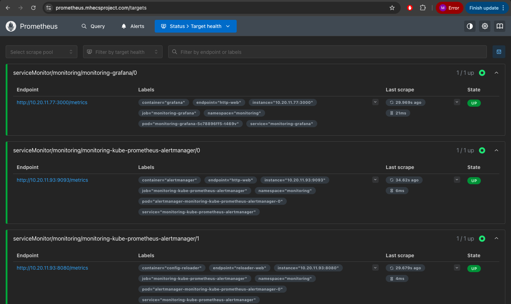
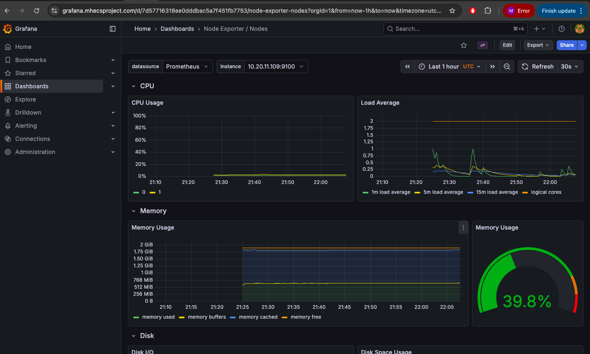

# EKS-Project
Cloud-Native EKS Application Platform

A production-style, cloud-native application platform deployed on Amazon EKS (Elastic Kubernetes Service) using Infrastructure as Code, GitOps automation, and full observability with Prometheus and Grafana.

This repository demonstrates how modern DevOps and platform engineering practices are applied end-to-end: from infrastructure provisioning, to application delivery, to monitoring and operational visibility.

### Overview

This project showcases a complete Kubernetes platform running on AWS EKS. It includes:

- Automated infrastructure provisioning using Terraform

- CI/CD pipelines using GitHub Actions

- GitOps application delivery with ArgoCD

- Secure ingress routing via NGINX Ingress Controller

- Automated TLS and DNS management

- Cluster-wide monitoring using Prometheus

- Custom Grafana dashboards for nodes, pods, and ingress traffic

The platform is designed to resemble real production environments and focuses on reliability, repeatability, and observability.

### Architecture
*Architecture Overview*


- A custom AWS VPC hosts an Amazon EKS cluster

- EKS worker nodes run application workloads and platform services

- External traffic enters through an AWS load balancer

- NGINX Ingress Controller routes requests to Kubernetes services

- ArgoCD continuously syncs Kubernetes manifests from Git

- Prometheus scrapes metrics from cluster components

- Grafana visualizes cluster health and traffic patterns

The EKS control plane is managed by AWS, while all workloads and platform tooling run inside the cluster.

### Application
*Node.js Demo Application*



A containerized Node.js application runs inside the EKS cluster and is exposed externally via the ingress layer.

- Built using a Dockerfile in the app/ directory

- Packaged and deployed using Kubernetes manifests

- Exposed via NGINX Ingress

- Observed through Prometheus ingress and pod metrics

- HTTP request counts and status codes are captured and visualized

### GitOps with ArgoCD
**ArgoCD**


ArgoCD provides declarative, Git-driven deployments for the platform.

- Kubernetes manifests and Helm values are stored in Git

- ArgoCD watches the repository and reconciles cluster state automatically

- Drift detection and self-healing ensure consistency

- Changes are deployed by committing to Git

- Rollbacks are performed by reverting commits

This ensures Git is the single source of truth for application and platform configuration.

### CI/CD Pipelines
**GitHub Actions**

The repository includes multiple GitHub Actions workflows to automate infrastructure and application delivery:

- terraform-plan.yml
Runs Terraform plan to validate infrastructure changes

- terraform-apply.yml
Applies Terraform changes to provision or update AWS infrastructure

- terraform-destroy.yml
Safely tears down infrastructure when required

- app-build-scan-deploy.yml
Builds the application container, performs security scanning, pushes images, and triggers GitOps deployment

These pipelines enforce repeatable and auditable changes across the platform lifecycle.

### Monitoring & Observability

## Monitoring (Prometheus + Grafana)

Deployed using Helm chart: kube-prometheus-stack.

### Install/Upgrade
```bash
helm repo add prometheus-community https://prometheus-community.github.io/helm-charts
helm repo update

kubectl create namespace monitoring || true

helm upgrade --install monitoring prometheus-community/kube-prometheus-stack \
  -n monitoring \
  -f k8s/monitoring/values-kube-prometheus-stack.yaml \
  --wait --timeout 10m

```


**Prometheus**



Prometheus is deployed to collect metrics from the Kubernetes cluster, including:

- Nodes (CPU, memory, readiness)

- Pods (status, restarts, health)

- Namespaces and services

- NGINX Ingress Controller (HTTP requests, status codes, latency)

These metrics provide time-series visibility into infrastructure and workload behavior.

### Grafana Dashboards


Grafana visualizes Prometheus metrics through custom dashboards, including:

**Cluster & Node Overview**

- Node readiness status

- CPU usage per node

- Memory usage per node

### Access

Grafana is exposed via NGINX Ingress using a custom hostname and HTTPS.

- URL: https://grafana.mhecsproject.com
- Ingress Controller: ingress-nginx
- TLS: Managed by cert-manager (Let’s Encrypt)
- DNS: Automatically created via ExternalDNS (Route53)

Authentication uses the default Grafana admin user.  
The admin password is stored in a Kubernetes Secret created by the Helm chart.

**Pod Health**

- Pods not ready

- Restart counts and restart rates

- Pods in failed, pending, or unknown states

**Ingress Traffic**

- HTTP request counts by host, ingress, and status

- Visibility into 200 / 404 responses

- Real-time traffic validation through the ingress layer

These dashboards provide operational insight into cluster stability, performance, and external traffic flow.

### Repo Structure

```

.
├── .github/workflows/              # CI/CD pipelines
│   ├── app-build-scan-deploy.yml
│   ├── terraform-plan.yml
│   ├── terraform-apply.yml
│   └── terraform-destroy.yml
│
├── app/                            # Application source code
│   ├── public/
│   ├── Dockerfile
│   ├── .dockerignore
│   ├── package.json
│   ├── package-lock.json
│   └── server.js
│
├── helm/                           # Helm-related configs
│   ├── cert-manager/
│   ├── external-dns/
│   └── ingress-nginx/
│
├── infra/                          # Terraform infrastructure
│   ├── envs/dev/                   # Environment-specific config
│   └── modules/
│       ├── eks/
│       └── vpc/
│
├── k8s/                            # Kubernetes manifests
│   ├── argocd/apps/                # ArgoCD Applications
│   ├── cert-manager/
│   ├── demo/                       # Application manifests
│   ├── ingress-nginx/
│   └── monitoring/                 # Prometheus & Grafana
│
├── .gitignore
└── README.md

```

### Prerequisites

- AWS account with appropriate permissions

- Terraform ≥ 1.5

- kubectl configured for EKS access

- Helm 3.x

- GitHub repository with Actions enabled

- AWS credentials configured for local development

### Future Enhancements
**EKS API Endpoint Security**

The EKS API endpoint is currently publicly accessible for simplicity. A production enhancement would include:

Restricting access using CIDR allow-lists

Dynamically allowing GitHub Actions IP ranges

Using VPC endpoints or PrivateLink for private API access

**Alerting**

Introduce Alertmanager rules for:

- High CPU or memory usage

- Pod crash loops

- Ingress error rate thresholds

**Resource Governance**

Add Kubernetes ResourceQuotas and LimitRanges to prevent namespace-level resource exhaustion and enforce fair resource usage.

**Backups & Disaster Recovery**

Implement automated EBS snapshots or AWS Backup for persistent data and Prometheus metrics.

## Summary

This repository demonstrates a production-grade Kubernetes platform on AWS EKS built with:

- Terraform-based infrastructure

- GitHub Actions CI/CD

- GitOps deployments via ArgoCD

- Secure ingress and automated TLS

- Prometheus metrics collection

- Grafana dashboards for cluster and ingress observability


